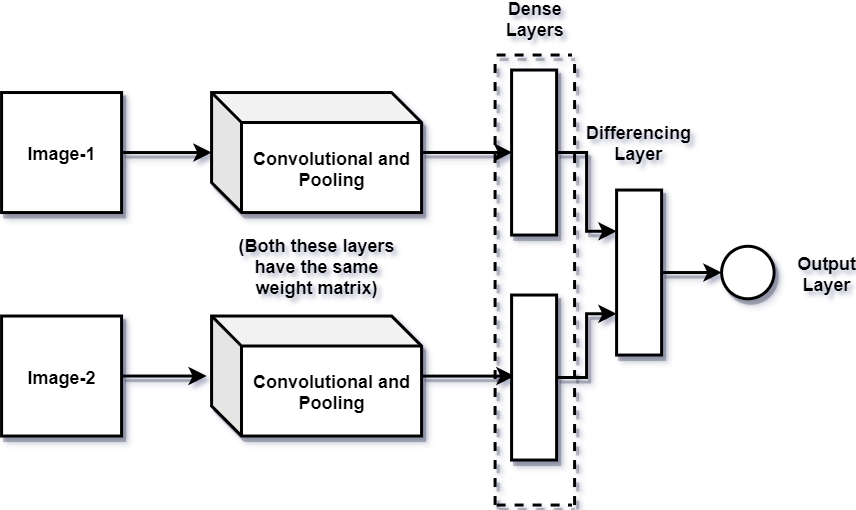
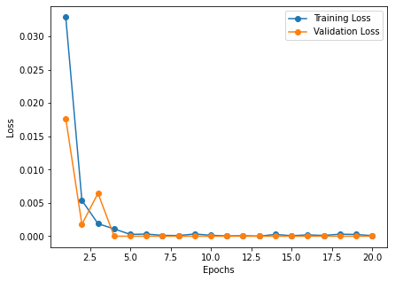
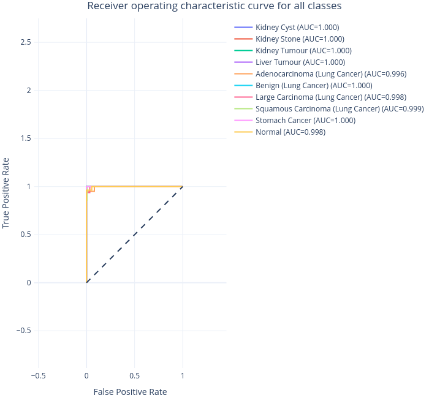
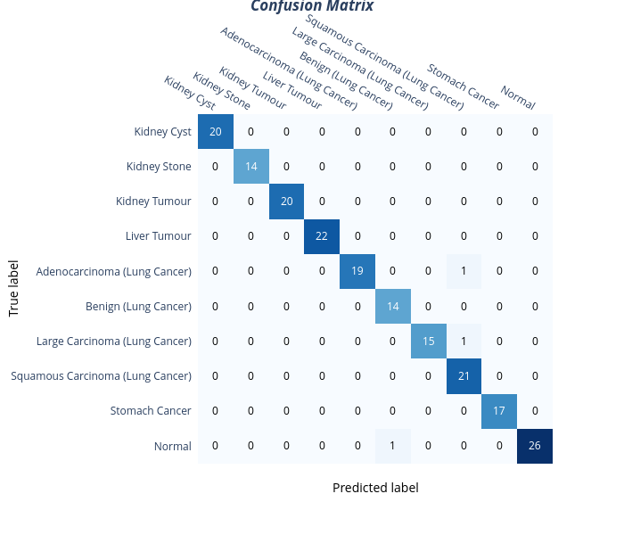

# Abstract

 One of the numerous serious illnesses that a person might have is abdominal sickness. The key to effective treatment of this illness may be early discovery. When analyzing large volumes of data for patterns or doing predictive analysis, machine learning (ML) is extremely helpful. There have been several efforts to diagnose and categorize illnesses using visual data. As contemporary science has advanced, several neural networks have shown to be helpful in illness prediction. Although a straightforward deep neural network (DNN) is preferred for automating the identification of anomalies in images, the lack of datasets for abdominal CT scan images makes it challenging to train the DNN. Meta-learning might overcome this issue. A multi-class classification algorithm using meta-learning to identify significant abdominal disorders has been developed in this research. A Siamese Neural Network was trained on the dataset for the classification challenge using VGG16 as the encoders. The proposed model achieved the accuracy, f1-score and specificity of 98%, 98%, and 99% on the test set for the detection of kidney cysts, kidney stone, kidney, tumor, adenocarcinoma lung cancer, benign lung cancer, large carcinoma lung cancer, squamous carcinoma lung cancer, stomach cancer and normal cases.

 

# Aims

 The goal of this research is to utilize artificial intelligence (AI) to identify serious abdominal disorders without the use of a human observer. The speeded-up procedure would shorten the time required to get from receiving a CT report to receiving appropriate care.

 

# Objectives

The objective of this project is to provide a multi-class categorization-based deep learning model for abdominal diagnostics. A CT scan is now the industry standard for the initial imaging of patients with serious abdominal diseases. Experiments will be carried out to create a few-shot learning model that will be used to automatically recognize the anomalies from kidney, lung, liver, and stomach CT images. The study will benefit patients and the healthcare industry, especially in understaffed small hospitals. To develop an all-encompassing model for predicting abdominal illness, deep learning techniques will be used to examine diagnostic data. The performance of various classifiers will be compared to the data that was labeled by knowledgeable radiologists in order to assess how well the model is predicting. 

 

# Methodology

The classification of kidney cysts, kidney stones, kidney tumors, liver tumors, four forms of lung cancer (adenocarcinoma, big carcinoma, squamous carcinoma, benign), stomach cancer, and normal instances from an abdominal CT scan is demonstrated in this chapter. The platforms Kaggle and Google Dataset are used to collect the needed data. Typically, jpg images are used to acquire CT scans. The developed model is then used to classify the images. Then, in order to determine if the abdomen CT scan contains abnormalities or not, the predicted and manually categorized pictures are input into the suggested model for classification, which uses random abdominal images as the test subject. 

 

# Data Collection

The lung benign cancer dataset was taken from “IQ-OTH/NCCD - Lung Cancer Dataset” (Alyasriy and Muayed, 2021), and the adenocarcinoma, large carcinoma, squamous carcinoma, and normal dataset of the lung were taken from the “Chest CT-Scan images Dataset” (Hany, 2020), the liver tumor dataset from “Liver and Liver Tumor Segmentation” (Bilic et al., 2019), the kidney cysts, kidney stones, kidney tumors dataset from “CT KIDNEY DATASET: Normal-Cyst-Tumor and Stone” (Islam et al. 2022) and the stomach cancer dataset from “Abdominal CT scans” (Gut, 2021). All the images in the curated dataset are in png/jpg format. Table 01 depicts the dataset distribution for the proposed model. 
 
 
Table 01: Dataset Distribution

|              Class               | Training Images | Testing Images | Overall Images |
| :------------------------------: | :-------------: | :------------: | -------------- |
|           Kidney Cyst            |       80        |       20       | 100            |
|           Kidney Stone           |       80        |       14       | 94             |
|          Kidney Tumour           |       80        |       20       | 100            |
|           Liver Tumour           |       80        |       22       | 102            |
|   Adenocarcinoma (Lung Cancer)   |       80        |       20       | 100            |
|       Benign (Lung Cancer)       |       80        |       14       | 94             |
|  Large Carcinoma (Lung Cancer)   |       80        |       16       | 96             |
| Squamous Carcinoma (Lung Cancer) |       80        |       21       | 101            |
|          Stomach Cancer          |       80        |       17       | 97             |
|              Normal              |       80        |       27       | 107            |
|                                  |     Overall     |                |
|                                  |       800       |      191       |                |

 

# Data Pre-Processing

Each image was individually classified into its class and added to a CSV file (comma-separated values). Since the labels in a CSV spreadsheet file are simpler to read, this format is employed. The anchor image, positive image, negative image, and label are the four columns that are present in every row of the CSV file. While the anchor and the positive image are different, the anchor and the negative image are comparable. The data is then subjected to additional analysis in order to prepare it for usage in the following steps. Data analysis comprises processes such as noise reduction, augmentation, normalization, and standardization. Because the efficiency of the features encoder dependent on the image quality, pre-processing is essential. The image's values are altered by the normalization and distribution processes, which also reduce the range, making it simpler to improve the model. Noise reduction helps to enhance the visual quality of the image and eliminates extraneous values. 

 

# Model Learning

Fig. 01: Learning pipeline of the  proposed model

 

# Proposed Model Results and Discussion

The siamese network was prepared to exhibit the discriminative capability of learnt features at few-shot learning after it had been tuned to accomplish the verification job. The suggested siamese network generates a prediction  provided a set of images. This value was thresholded by choosing an appropriate cutoff just on validation set that corresponded to a binary label while formulating predictions for verification. 

 

Fig. 02: Training vs Validation Loss 

 

At the beginning of training, the model's training loss was around 0.035%, and the validation loss was approximately 0.017%. As training progressed, the training loss decreased progressively, however the validation loss peaked at about 0.001% at the beginning of epoch 5. Both the training loss and the validation loss lines had values of roughly 0.0001% at the end of the training.
 
 
A summary of the model's performance has been shown on Table 02.    

Table 02: Class-wise score of the proposed model
 

|              |              Labels              | Precision | Recall | F1 score | AUC ROC | Accuracy | Specificity | support |
| ------------ | :------------------------------: | :-------: | :----: | :------: | :-----: | :------: | :---------: | :-----: |
|              |           Kidney Cyst            |   1.00    |  1.00  |   1.00   |  1.00   |   1.00   |    1.00     |   20    |
|              |           Kidney Stone           |   1.00    |  1.00  |   1.00   |  1.00   |   1.00   |    1.00     |   14    |
|              |          Kidney Tumour           |   1.00    |  1.00  |   1.00   |  1.00   |   1.00   |    1.00     |   20    |
|              |           Liver Tumour           |   1.00    |  1.00  |   1.00   |  1.00   |   1.00   |    1.00     |   22    |
|              |   Adenocarcinoma (Lung Cancer)   |   1.00    |  0.95  |   0.97   |  0.975  |   0.99   |     1.0     |   20    |
|              |       Benign (Lung Cancer)       |   0.93    |  1.00  |   0.97   |  0.997  |  0.994   |    0.994    |   14    |
|              |  Large Carcinoma (Lung Cancer)   |    1.0    |  0.94  |   0.97   |  0.97   |  0.995   |     1.0     |   16    |
|              | Squamous Carcinoma (Lung Cancer) |   0.91    |  1.0   |   0.95   |  0.99   |   0.99   |    0.98     |   21    |
|              |          Stomach Cancer          |    1.0    |  1.0   |   1.0    |   1.0   |   1.0    |     1.0     |   17    |
|              |              Normal              |    1.0    |  0.96  |   0.98   |  0.98   |   0.99   |     1.0     |   27    |
| Micro avg    |                                  |   0.98    |  0.98  |   0.98   |  0.99   |   0.98   |             |   191   |
| Macro avg    |                                  |   0.98    |  0.99  |   0.98   |  0.99   |          |             |   191   |
| Weighted avg |                                  |   0.99    |  0.98  |   0.98   |         |          |             |   191   |
| Samples avg  |                                  |   0.98    |  0.98  |   0.98   |         |          |             |   191   |

 

The sensitivity (or TPR) and specificity of the classification model are shown on the ROC curve. Better outcomes are indicated by models that produce curves which are closest to the top-left corner. The ROC AUC curve of the proposed model has been shown in Fig. 03. 
  

Fig. 03: ROC AUC Curve 

 

A confusion matrix gathers the anticipated results of a classification issue. The amount of accurate and incorrect predictions for every class is expressed using count values. Fig. 05 displays the confusion matrix derived from the test set prediction. 
 

Fig. 04: Confusion Matrix 

 
 

# Conclusions and Recommendations

In this work, a new methodology to identify significant anomalies from an abdominal CT scan has been developed. The method included developing deep convolutional siamese neural networks first for verification, then doing few-shot multi-class classification. For building a machine learning model to identify all significant anomalies from abdominal medical images, no work has been published. The suggested networks, which use just 800 pictures for the training dataset for 10 multi-class categories, are quite similar to the best results obtained by the previous researchers. The proposed model achieved the accuracy, f1-score and specificity of 98%, 98%, and 99% on the test set for the detection of kidney cysts, kidney stone, kidney, tumor, adenocarcinoma lung cancer, benign lung cancer, large carcinoma lung cancer, squamous carcinoma lung cancer, stomach cancer and normal cases. The suggested network performed well on this challenge, showing that our metric learning technique may achieve accuracy on par with that of humans and that it should be applied to additional few-shot learning problems, particularly those involving image classification.

Since this is a collection of CT images, adding an LSTM layer with a convolutional layer may be advantageous. The work's main drawback is computational time, particularly during the time-consuming stage of hyperparameter adjustment, instead of any other fundamental problem with boosting model capacity. Additionally, no regularization technique was used to the network, which presents a highly promising opportunity for future advancement. To evaluate the model's performance, only cross-entropy loss, triplet loss, and margin ranking loss were employed. This would urge the network to concentrate primarily on revising its predictions if either the gap between similar cases was great or the distance between different examples was small, as opposed to the smooth behavior of the cross-entropy loss.  The suggested architecture should work well for additional few-shot datasets, therefore expanding the proposed technique to other data sets is a final area of significant interest. Finding additional data that is either immediately suited to few-shot learning or from where new few-shot trials may be generated is the natural next step, after which a comparable iteration of the proposed model could be trained. Convolutional features are used, hence the recommended method may be used right away for any other image recognition issue. Further N-way K-shot learning settings might be used in the trials to gauge how well the characteristics picked up by the suggested deep siamese networks can be generalized. 
